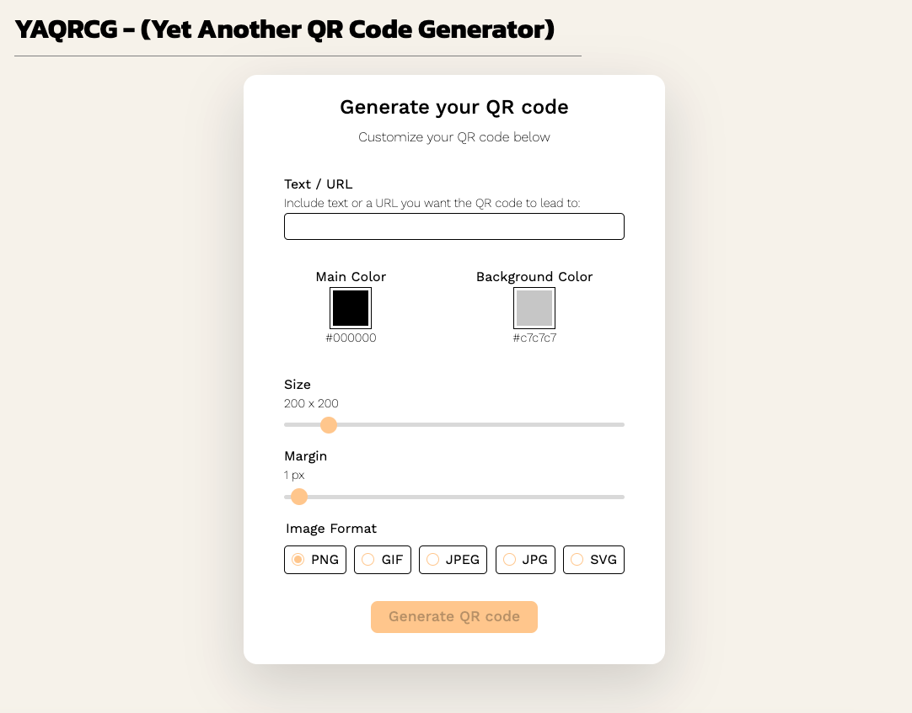

# YAQRCG - Yet Another QR Code Generator 

<a href="https://goqr.me/api/" target="_blank" rel="noopener"
    style="padding:0.35rem 0.7rem;
    color: black;
    background: #F1DEDE;
    border-radius:10px;
    font-size:0.85rem;
    font-weight:600;">Official API Docs</a> 

---

## Description
This is a simple QR code generator that allows you to generate QR codes based on text or URL input. It provides flexibility to adjust the QR code's color, background color, size, margin, and image format. This project is open source, free to use, modify, and distribute it as per the provided license.

## Features
- Generate QR codes from text or URL input
- Customize the QR code's color and background color
- Adjust the size and margin of the QR code
- Export the generated QR code in various image formats

## Installation
- Clone the repository: `git clone <https://github.com/shmkl/yaqrcg.git>`
- Change to the project directory: `cd qr-code-generator`

## Contributing
Contributions are welcome! If you find a bug or have a suggestion for improvement, please open an issue or submit a pull request on the GitHub repository.

## License
This project is licensed under the MIT License. See the <a href="<https://opensource.org/license/mit/">LICENSE</a> file for more information.

## Preview
